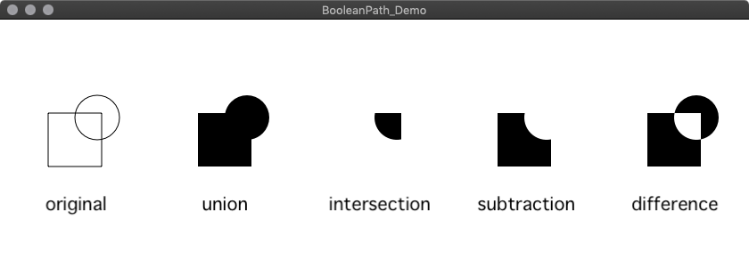

# Swift BooleanPath for macOS
Boolean Function for NSBezierPath

### Notes
- The current version for Xcode10 Swift4 is available.

## About BooleanPath
This is an macOS rewite of the code for Leslie Titze's [VectorBoolean]().

It compiles under Xcode10 and includes an macOS app which shows the example of using the code.

